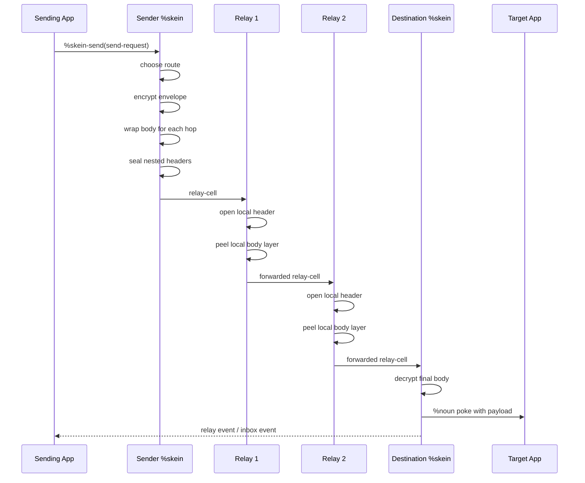

# %skein

`%skein` is a routed transport for Urbit apps. It lets one app send opaque payloads to another app through a relay chain, and it provides discovery, inbox queues, relay events, retries, batching, and a small operator UI.

If you are building an app on Urbit and you want multi-hop delivery without inventing a transport layer from scratch, `%skein` is the piece you integrate with.


## What it does

- binds local apps so they can send and receive through `%skein`
- discovers relays through relay-pool gossip
- selects relay routes using weight, health, trust, and minimum-hop settings
- encrypts routing headers per hop
- encrypts message bodies and wraps them in per-hop body layers
- forwards cells through relays with optional hop delays and epoch batching
- retries failed first-hop sends with backoff
- exposes relay events and per-app inbox watches
- supports channel-based peer discovery
- builds reply blocks

## Quick start

### 1. Bind an app and discover a relay

```hoon
/-  *skein
:~  [%pass /discover %agent [our %skein] %poke %skein-admin !>([%discover-relay ~sampel-palnet])]
    [%pass /bind %agent [our %skein] %poke %skein-admin !>([%bind %echo])]
==
```

### 2. Send a message

```hoon
/-  *skein
=/  req=send-request
  [ from=%echo
    to=[ship=~sampel-palnet app=%echo]
    payload=[%say 'hello over skein']
    opts=[route=~ reply-blocks=~ ttl=~]
  ]
[%pass /send %agent [our %skein] %poke %skein-send !>(req)]
```

### 3. Watch events and your app inbox

```hoon
[%pass /relay-events %agent [our %skein] %watch /relay/events]
[%pass /echo-inbox %agent [our %skein] %watch /app/echo/inbox]
```

### 4. Inspect state with scries

```hoon
.^(noun %gx /=skein=/x/stats/noun)
.^(noun %gx /=skein=/x/descriptors/noun)
.^(noun %gx /=skein=/x/routes/noun)
```

## How message delivery works

1. Your app sends a `send-request` to `%skein`.
2. `%skein` chooses a route unless you supplied one.
3. `%skein` encrypts the message envelope under a body key.
4. `%skein` wraps the encrypted body in one layer per hop.
5. `%skein` builds a nested header so each relay can open only its own hop instructions.
6. Each relay opens one header layer, peels one body layer, and forwards to the next hop.
7. The destination `%skein` opens the final body, queues the envelope, emits an event, and pokes the target app with the payload.

If the target ship is local and no remote route is needed, `%skein` delivers locally instead of building a routed cell.

## Flow diagram



## Common tasks

### Join a discovery channel

```hoon
/-  *skein
[%pass /join %agent [our %skein] %poke %skein-admin !>([%join-channel %silk-market %echo])]
```

Channel updates are forwarded to the joined app as tagged `%noun` pokes:

```hoon
[%channel-join channel-id ship]
[%channel-leave channel-id ship]
[%channel-members channel-id (list ship)]
```

### Set routing policy

```hoon
/-  *skein
=/  rid=relay-id  (scot %p ~sampel-palnet)
:~  [%pass /min-hops %agent [our %skein] %poke %skein-admin !>([%set-min-hops 2])]
    [%pass /adaptive %agent [our %skein] %poke %skein-admin !>([%set-adaptive-hops %.y])]
    [%pass /trust %agent [our %skein] %poke %skein-admin !>([%trust-relay rid])]
==
```

### Build a reply block

```hoon
/-  *skein
[%pass /reply-block %agent [our %skein] %poke %skein-admin !>([%build-reply-block ~])]
```

You can also inspect a freshly generated one with:

```hoon
.^(noun %gx /=skein=/x/reply-block/noun)
```

## Security notes

What `%skein` gives you:

- relays do not get a cleartext origin, target, or full route in the cell format
- each relay opens one header layer and peels one body layer
- non-final relays are not supposed to see the final message payload
- routes can include multiple relay hops with optional delay and batching

What `%skein` does not give you:

- authenticated sender identity inside the delivered envelope
- a private channel membership system
- signed relay discovery
- fixed-size traffic
- strong protection against active tagging or timing correlation

Practical meaning:

- use `%skein` as a routed transport layer
- do not describe it as a high-assurance anonymity system
- if your app needs authenticated senders, add authentication at the app layer
- if your app needs private peer discovery, do not rely on channels for that

## Interface summary

### Marks

- `%skein-admin`
- `%skein-send`
- `%skein-cell`
- `%skein-event`
- `%skein-relay-pool`
- `%skein-channel`

### Common admin actions

- `%bind` / `%unbind`
- `%discover-relay`
- `%join-channel` / `%leave-channel`
- `%set-min-hops`
- `%set-adaptive-hops`
- `%trust-relay` / `%untrust-relay`
- `%add-seed` / `%drop-seed`
- `%clear-seen`
- `%build-reply-block`

### Watches

- `/relay/events`
- `/relay/pool`
- `/channel/<channel-id>`
- `/app/<app>/inbox`

### Scries

- `/x/state`
- `/x/app/<app>`
- `/x/descriptors`
- `/x/routes`
- `/x/stats`
- `/x/reply-block`
- `/x/health`
- `/x/trusted`
- `/x/seeds`

## Repository guide

- [desk/app/skein.hoon](desk/app/skein.hoon): main Gall agent
- [desk/sur/skein.hoon](desk/sur/skein.hoon): transport types
- [desk/sur/skein-crypto.hoon](desk/sur/skein-crypto.hoon): crypto-layer types
- [desk/tests/app/skein.hoon](desk/tests/app/skein.hoon): test coverage
- [ui/](ui/): operator dashboard
- [sync](sync): desk/UI sync helper

## Tests

The test file at [desk/tests/app/skein.hoon](desk/tests/app/skein.hoon) covers:

- jam / cue payload round-trips
- symmetric encryption round-trips
- shared-secret round-trips
- sealed header/body round-trips
- body onion wrap / peel round-trips
- seen-cache pruning
