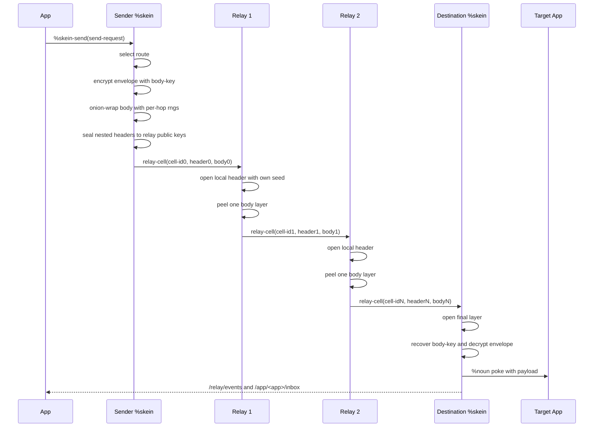

# %skein

`%skein` is a routed transport for Urbit applications. It moves opaque app payloads through relay chains, exposes Gall marks and scries for app integration, and ships a small HTTP/UI operator surface. `../silk` uses it as its transport layer.

The current code is substantially stronger than the older prototype: relay descriptors publish a public key instead of a shared relay secret, headers are sealed per hop, the body is onion-wrapped per hop, and honest forwarding rotates both the visible `cell-id` and the body ciphertext at every hop.

It is still not a finished anonymity system. The right description today is "practical routed transport with some relay privacy properties", not "hardened mixnet".

## Current Status

Implemented in the current code:

- app bind / unbind and per-app inbox queues
- relay discovery through `/relay/pool`
- local route selection with relay weight, health, trust, and adaptive minimum hops
- per-hop header sealing to relay public keys
- per-hop body onion layers
- per-hop `cell-id` reassignment during honest forwarding
- minimum body padding to 8KB and minimum outer-header padding to 2KB
- delayed forwarding with epoch batching
- bounded first-hop retry with backoff
- adaptive cover traffic
- relay health tracking and operator trust sets
- channel-based peer discovery
- HTTP control API and Vite-based operator UI
- state migrations through `state-18`

Implemented, but still partial:

- reply-block construction exists, but there is no live "send reply via reply block" path yet
- discovery is still unsigned pool gossip, rooted in a seed set
- channels are explicit membership directories, not a private discovery primitive
- cells are not fixed-size, and there is no Sphinx-style per-hop rerandomization

## How It Works

1. A local app binds to `%skein`.
2. `%skein` learns relay descriptors from seed ships and relay-pool gossip.
3. An app sends a `send-request` to `%skein`.
4. `%skein` picks a route, unless the caller supplied one.
5. The sender encrypts the envelope under a random body key, then onion-wraps the body once per hop.
6. The sender builds a nested header where each layer is sealed to one relay's public key and contains only that hop's forwarding instructions.
7. Each honest relay opens only its own header layer, peels only its own body layer, swaps in the next `cell-id`, and forwards.
8. The final relay recovers the body key, opens the envelope, queues it, emits events, and pokes the destination app with the payload.

If the destination ship is local and no remote route is needed, `%skein` short-circuits to loopback delivery instead of building a routed cell.

## Message Flow



## Transport Model

Core types live in `desk/sur/skein.hoon`.

- `endpoint`: `[ship app]`
- `relay-descriptor`: relay id, ship, public key, weight, default delay, optional expiry
- `route`: ordered list of `route-hop`s plus a `route-id`
- `relay-cell`: visible `cell-id`, sealed header, wrapped body, optional expiry
- `send-request`: local app, destination endpoint, opaque payload, optional route / reply blocks / ttl
- `channel-update`: `%join`, `%leave`, or `%members`

Route selection is source-side. If a caller does not provide a route, `%skein` selects intermediate relays from the known pool using descriptor weight, relay health, and the operator trust set. Trusted relays receive a weight boost. If adaptive hops are enabled, the effective hop floor increases with the relay-pool size.

## What An Honest Relay Learns

An honest relay does not get the whole route or the final plaintext by design anymore.

It does learn:

- the immediate previous hop from Gall transport
- the next hop from its decrypted local header layer
- the current visible `cell-id`
- its own forwarding delay
- one peeled version of the body ciphertext

It should not be able to learn:

- the remaining downstream route from header material alone
- the final payload plaintext
- the original body ciphertext from earlier hops

That is a real improvement over the previous design.

## Security Reality

### What Improved

- Relay descriptors no longer publish a symmetric hop-decryption key.
- Header layers are sealed to relay public keys, so relay-pool access alone is not enough to open arbitrary downstream layers.
- Honest forwarding changes both the visible `cell-id` and the body ciphertext on every hop.
- Minimum padding now exists for both the body and the outermost header.

### What Still Fails Or Leaks

- The claimed `origin` inside the decrypted envelope is not authenticated. A party that can build a route can send a cell claiming an arbitrary origin endpoint.
- The visible `cell-id` is not cryptographically bound to the encrypted header/body. A malicious relay can rewrite it or replay a cell under a fresh id.
- Discovery remains unsigned. A malicious seed or early relay can bias the visible relay set, inject Sybils, or feed bogus descriptors.
- Channel subscriptions leak membership. Channel subscribers receive full member lists and join / leave updates.
- Cells are not normalized end-to-end. Large payloads still leak size above the minimum padding floor, and forwarded headers shrink as layers are peeled.
- There is no Sphinx-style re-encapsulation or strong tagging resistance.
- Epoch batching and delays help a little, but they are not enough to stop a capable timing-correlation attacker.

### Threat Models That Still Beat It

Without assuming the attacker owns the whole network or the endpoints:

- A malicious participant can forge messages that claim to come from another `origin`.
- A malicious relay on-path can tag or clone traffic by rewriting the visible `cell-id`.
- Two colluding relays can still correlate sender-side and receiver-side traffic by timing, retries, path shape, and size.
- A malicious seed or Sybil relay operator can heavily influence route selection by shaping the relay pool.
- Any channel subscriber can enumerate channel members, which can be enough to defeat application-level privacy even if the routed transport path itself behaves correctly.

So the current design is no longer "blindly broken" in the old way, but it still falls short of a robust anonymity network.

## Is Traffic Blindly Forwarded?

Mechanically, mostly yes.

An honest relay opens one local header layer, peels one body layer, reads the next hop and delay, swaps in the next `cell-id`, and forwards. It does not need the full route or final plaintext to do that.

Security-wise, not completely.

The forwarding path is still vulnerable to active manipulation because the outer `cell-id` is not authenticated, and the decrypted envelope does not authenticate the claimed sender. So "blind forwarding" is true for honest relays, but not a complete security story against malicious relays or malicious senders.

## Interfaces

### Gall Marks

- `%skein-admin`
- `%skein-send`
- `%skein-cell`
- `%skein-event`
- `%skein-relay-pool`
- `%skein-channel`

### Admin Actions

- `%bind` / `%unbind`
- `%clear`
- `%put-relay` / `%drop-relay` / `%discover-relay`
- `%clear-seen`
- `%join-channel` / `%leave-channel`
- `%set-min-hops`
- `%add-seed` / `%drop-seed`
- `%set-adaptive-hops`
- `%build-reply-block`
- `%trust-relay` / `%untrust-relay`

### Watches

- `/relay/events`
- `/relay/pool`
- `/channel/<channel-id>`
- `/app/<app>/inbox`

### Scries

- `/x/state`
- `/x/app/<app>`
- `/x/descriptors`
- `/x/routes`
- `/x/stats`
- `/x/reply-block`
- `/x/health`
- `/x/trusted`
- `/x/seeds`

### HTTP API

Authenticated via Eyre session cookie at `/apps/skein/api`.

`GET` endpoints:

- `/stats`
- `/relays`
- `/routes`
- `/apps`
- `/batch`
- `/channels`
- `/health`
- `/trusted`

`POST` actions:

```json
{"action":"put-relay","ship":"~sampel-palnet"}
{"action":"drop-relay","relay":"~sampel-palnet"}
{"action":"clear-seen"}
{"action":"bind-app","app":"echo"}
{"action":"unbind-app","app":"echo"}
{"action":"join-channel","channel":"silk-market","app":"echo"}
{"action":"leave-channel","channel":"silk-market"}
{"action":"set-min-hops","n":2}
{"action":"add-seed","ship":"~sampel-palnet"}
{"action":"drop-seed","ship":"~sampel-palnet"}
{"action":"set-adaptive-hops","on":true}
{"action":"build-reply-block"}
{"action":"trust-relay","relay":"~sampel-palnet"}
{"action":"untrust-relay","relay":"~sampel-palnet"}
```

`put-relay` means "subscribe to this ship's `/relay/pool`" rather than "install an arbitrary descriptor from JSON".

## Using It

### Operator Setup Over HTTP

Discover relays, bind an app, and inspect state:

```sh
curl --cookie "$COOKIE" \
  -X POST http://localhost:8080/apps/skein/api \
  -H 'Content-Type: application/json' \
  -d '{"action":"put-relay","ship":"~sampel-palnet"}'

curl --cookie "$COOKIE" \
  -X POST http://localhost:8080/apps/skein/api \
  -H 'Content-Type: application/json' \
  -d '{"action":"bind-app","app":"echo"}'

curl --cookie "$COOKIE" \
  http://localhost:8080/apps/skein/api/stats

curl --cookie "$COOKIE" \
  http://localhost:8080/apps/skein/api/relays
```

Join a discovery channel:

```sh
curl --cookie "$COOKIE" \
  -X POST http://localhost:8080/apps/skein/api \
  -H 'Content-Type: application/json' \
  -d '{"action":"join-channel","channel":"silk-market","app":"silk-core"}'

curl --cookie "$COOKIE" \
  http://localhost:8080/apps/skein/api/channels
```

### Sending From Another Gall App

Bind your app first:

```hoon
/-  *skein
[%pass /bind %agent [our %skein] %poke %skein-admin !>([%bind %echo])]
```

Then send a payload:

```hoon
/-  *skein
=/  req=send-request
  [ from=%echo
    to=[ship=~sampel-palnet app=%echo]
    payload=[%say 'hello over skein']
    opts=[route=~ reply-blocks=~ ttl=~]
  ]
[%pass /send %agent [our %skein] %poke %skein-send !>(req)]
```

If the destination app is bound on the receiving ship, `%skein`:

- queues the full envelope for `/app/<app>/inbox` watchers
- emits a `%skein-event` on `/relay/events`
- pokes the destination app with the payload as `%noun`

### Watching Events

Watch relay events:

```hoon
[%pass /relay-events %agent [our %skein] %watch /relay/events]
```

Watch an app inbox:

```hoon
[%pass /echo-inbox %agent [our %skein] %watch /app/echo/inbox]
```

### Using Channels

Join a channel:

```hoon
/-  *skein
[%pass /join %agent [our %skein] %poke %skein-admin !>([%join-channel %silk-market %echo])]
```

Channel updates are forwarded to the joined app as `%noun` pokes shaped like:

```hoon
[%channel-join channel-id ship]
[%channel-leave channel-id ship]
[%channel-members channel-id (list ship)]
```

Use channels for peer discovery, not for hidden membership.

### Reply Blocks

You can build a reply block today:

```sh
curl --cookie "$COOKIE" \
  -X POST http://localhost:8080/apps/skein/api \
  -H 'Content-Type: application/json' \
  -d '{"action":"build-reply-block"}'
```

You can also scry `/x/reply-block` for a freshly generated one.

What is missing is the other half: there is still no live transport path that consumes a reply block and turns it into an actual return message flow.

## Operator UI And Sync

The repo ships a standalone Vite single-page dashboard in `ui/`.

- reads `/apps/skein/api/{stats,apps,relays,routes,batch,channels,health,trusted}`
- exposes relay discovery, bind / unbind, seed management, trust management, adaptive hops, and replay-cache management
- is bundled to a single file with `vite-plugin-singlefile`

`./sync` builds the UI, uploads the bundle, updates `desk/desk.docket-0`, and syncs the desk to the configured pier path.

## Tests

`desk/tests/app/skein.hoon` currently covers:

- jam / cue payload round-trips
- `crub` symmetric encryption round-trips
- X25519-style shared-secret commutativity
- ephemeral seal / open round-trips
- body onion wrap / peel round-trips
- seen-cache pruning

These are useful correctness checks. They are not anonymity or transport-security proofs.

## Remaining Work

The most important unfinished items are:

- add authenticity for the claimed `origin`
- bind or authenticate the visible forwarding metadata, especially `cell-id`
- harden discovery with signed descriptors and better multi-source validation
- make route correlation harder with stronger rerandomization and better normalization
- decide whether channels should remain explicit membership directories
- finish reply-block integration
