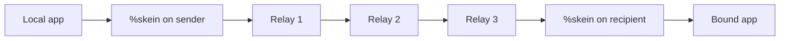
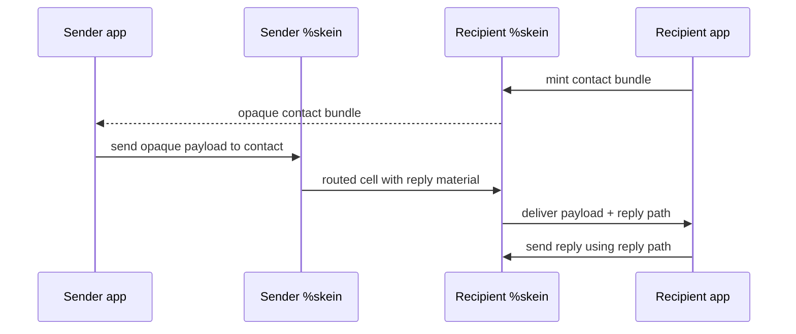

# %skein

`%skein` is an overlay transport for Urbit apps.

Instead of sending a direct ship-to-ship poke, a local app hands `%skein` an opaque payload and asks it to deliver that payload over a routed path. The app can target either a known endpoint or an opaque contact bundle. In the contact-bundle case, the caller does not need to know the destination ship at all.

`%skein` is the transport layer under `%silk`, but it is intended to be usable by any Urbit app that wants routed delivery, replyable contacts, relay discovery, and a cleaner privacy boundary than direct application pokes.

## Why `%skein` exists

Direct Urbit app-to-app messaging is simple, but it ties together three things that many applications would rather keep separate:

- who you are at the transport layer
- how someone reaches you
- what application-level identity you want to present

`%skein` separates those concerns.

- An app can publish a contact bundle instead of a raw `[ship app]` address.
- A sender can deliver a message without learning the final ship directly from the application protocol.
- A recipient can answer over a return path instead of inventing a new direct route.
- A node can join the network from a small seed set and discover more relays over time.

## Mental model

There are five important ideas in `%skein`:

- `app`: a local Gall agent that binds to `%skein`
- `relay`: a ship that agrees to forward routed cells
- `route`: a multi-hop path through relays
- `contact bundle`: an opaque capability that lets another app reach you
- `reply block`: a prebuilt return path attached to a message so the recipient can answer

The sender gives `%skein` a payload. `%skein` turns that into a routed cell, relays peel one hop at a time, and the destination `%skein` delivers the recovered payload to the local bound app.

## How message delivery works

At a high level, `%skein` treats transport as a relay problem rather than a direct addressing problem.

1. A local app binds to `%skein`.
2. `%skein` maintains a relay pool learned from seed ships and relay descriptors.
3. The sender chooses either a direct endpoint or a contact bundle as the destination.
4. `%skein` selects a route set that satisfies its hop and policy rules.
5. It builds one encrypted header layer per hop and wraps the body in one layer per hop.
6. Each relay opens only its own forwarding instruction, peels one body layer, and forwards the cell.
7. The destination `%skein` unwraps the final payload and hands it to the target app.

The relays do forwarding work; the application payload remains opaque to them unless they are the final destination.

## Contacts and reply paths

The contact bundle is the core abstraction that makes `%skein` useful to higher-level apps.

A contact bundle is not just a name. It is a reachability capability. A higher-level app can hand it to someone else and say, in effect, "use this if you want to talk to me again."

Reply paths are handled the same way. When `%skein` delivers a message, it can attach fresh reply material so the recipient can answer without learning or storing a direct route.

This is why `%skein` is a good substrate for pseudonymous applications: application protocols can exchange capabilities instead of raw ship addresses.

## Relay discovery and joining the network

`%skein` is designed so a node can start from limited knowledge.

The normal path is:

1. know one or more seed ships
2. subscribe to relay information
3. collect signed relay descriptors
4. build a local relay pool
5. select multi-hop routes from that pool

That means a new participant does not need a full map of the network up front. They only need enough information to bootstrap discovery.

## Reliability model

Overlay transport is only useful if it keeps working while the network changes. `%skein` therefore treats delivery as a bounded retry problem, not a single-shot route guess.

The current design includes:

- multi-hop route selection with minimum-hop policy
- route sets with alternates
- bounded retry with backoff
- fresh route reselection when alternates are exhausted
- queued recovery when a send initially has no route
- consumed-entry tracking for one-shot ingress material
- sender-side tracking for intro-bundle progress and exhaustion
- profile-aware cell sizing and timing
- lightweight cover traffic and delayed forwarding batches

The goal is not to promise perfect delivery. The goal is to make routed delivery robust enough that an application can use it as ordinary plumbing instead of a fragile experiment.

## Privacy model

`%skein` improves the privacy boundary between applications and transport, but it should be understood as a practical overlay transport rather than a complete anonymity system.

What it is trying to do:

- hide the full route from any single relay
- let applications exchange opaque reachability handles instead of raw ship endpoints
- make replies work through return paths rather than direct addressing
- reduce the amount of transport identity that higher-level protocols need to expose

What it does not claim to solve by itself:

- a global observer that can correlate timing and traffic shape everywhere
- strong Sybil resistance in relay discovery
- private membership for explicit channels
- on-chain payment privacy

The right mental model is: `%skein` gives Urbit apps a routed, capability-based transport with materially better separation than direct pokes.

## Main operator surfaces

`%skein` exposes a small set of Gall interfaces for apps and operators:

- admin actions for binding apps, managing seeds, trusting relays, minting contacts, and tuning hop policy
- send requests for routed delivery
- watches for relay events, relay pools, channels, and bound app inboxes
- scries for descriptors, routes, contacts, reply blocks, and transport stats

That makes `%skein` usable both as a hidden transport dependency and as an inspectable networked service.

## Relationship to `%silk`

`%skein` is transport only.

It decides how opaque payloads move across a relay network. It does not define marketplace identities, listings, orders, escrow, or reputation. `%silk` builds those higher-level ideas on top of `%skein`.
